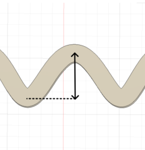

# Weave_B3D
This Autodesk Fusion 360 add-in generates a serpentine or wavy pattern on the surface of a selected B-Rep body.

## Usage
First see [How to install sample Add-Ins and Scripts](https://help.autodesk.com/view/fusion360/ENU/?guid=GUID-B81A4B10-3781-4925-94C6-47DA85A4F65A)
For spanish: [Ayuda](./resources/Weave_B3D_help.html)

## General Description

This command is designed to generate a serpentine rope pattern around a solid body. The selected body remains intact; its shape is only used to create multiple new bodies in the form of sinusoidal waves along the Z-axis.

---

## Configuration Parameters

### Select body

Here you select the body to which you want to generate its woven shape. It only accepts one body per process.

### Total waves

This value controls how many complete waves appear along the perimeter of the body.

* A **low** value (e.g., 10): It's fast, but creates very few waves for large parts.
* A **moderate** value (e.g., 60): It's fast and creates enough waves for a good woven effect.
* A **high** value (e.g., 100): It will considerably increase the calculation time but may look good on large parts.

### Rope thickness

This value specifies the thickness of the rope to be generated. This value may not be exact, as Fusion sometimes cannot generate the thickness for any geometry, and the plugin retries with a slightly smaller or larger value.

* A **low** value (e.g., 0.2mm): It's fast but may be too thin for some applications.
* A **high** value (e.g., 3.2mm): It can cause errors as it is difficult to draw in complex geometries.

### Rope height

This value controls the height of each generated rope, ideal for creating ropes with multiple printing layers.

* Example: If you print at a 0.4mm layer height and want each rope to have 2 layers, you should enter 0.8mm in this field.

### Maximum wave amplitude

This value controls how large each wave of the rope to be generated will be. The plugin will automatically adjust this value for very narrow places.

* A **low** value (e.g., 0.1mm): Generates a barely perceptible wavy effect.
* A **high** value (e.g., 5mm): Could generate overhangs that are difficult to print.

### Wave offset between ropes (0-360)

This value controls how the waves of each rope are drawn and the phase shift between them.

* A value of **0** or **360**: Generates all waves aligned vertically.
* A value of **180**: Generates a classic woven effect by alternating the waves between each rope.

### Internal/External offset (-2mm/+2mm)

This value applies a general offset to the ropes, either inwards or outwards from the main body.

* **0mm**: Generates ropes with waves that, at their innermost point, touch the surface of the original body.

### Generate pattern only

This checkbox is used to generate only the pattern of the ropes and not all the ropes that would be on the selected body.

* Ideal if you are not sure about all your parameters and want to preview the result with a few ropes before applying it to a large design.
* Ideal if you want to apply it to a simple shape (like a cylinder). It is faster to generate only the pattern and then repeat it manually.

---

## License
Licensed under the terms of the [Attribution-NonCommercial-ShareAlike 4.0 International](LICENSE.md).

---

## Written by 
Written by [Jacobo Castro](https://www.linkedin.com/in/icobiche/) for [Boceto3D](https://www.instagram.com/boceto.3d/)  
(Autodesk Developer Network)